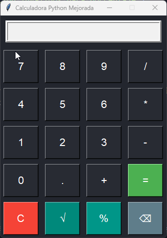

# 🧮 Calculadora Gráfica en Python (Tkinter)

---

📘 Descripción

Esta calculadora gráfica está hecha con **Python** y la librería estándar **Tkinter**. Permite realizar operaciones matemáticas básicas, raíces, porcentajes y cuenta con una interfaz bonita y moderna. Su función de porcentaje ha sido adaptada para comportarse igual que en las calculadoras físicas (ejemplo: `650*30 %` da el 30% de 650).

---

🧰 Tecnologías Utilizadas

🐍 Python 3.x

---

## 🖼️ Vista previa


---

## Características

- Suma, resta, multiplicación y división
- Raíz cuadrada, porcentaje y retroceso (borrar último dígito)
- Interfaz gráfica moderna y funcional
- Manejo de errores con mensajes
- Uso intuitivo de la función de porcentaje para operaciones tipo “valor * %”
- Fácil de instalar y ejecutar en Windows, Mac y Linux

---

## 📊 Lenguajes y Herramientas

[](https://skillicons.dev)


---

## 📊 Instalación

1. **Instala Python 3.x:**  
   Descárgalo de [python.org](https://www.python.org/)  
   En Linux, instala Tkinter si da error con:  
   `sudo apt-get install python3-tk`

2. **Descarga el archivo**  
   - Guarda el archivo `calculadora.py` en tu computador.

3. **Ejecuta la calculadora**  
   - Abre una terminal y ejecuta:  
     ```
     python calculadora.py
     ```
   - Aparecerá la ventana gráfica.

---

## 🚀 Uso

- Haz clic en los botones para formar la operación.
- Usa el botón **C** para limpiar, **⌫** para borrar el último dígito.
- **%** calcula porcentajes al estilo calculadora física:
  - Ejemplo: `650 * 30` + `%` resulta en **195.0** (el 30% de 650).
  - Ejemplo: `1000 + 25` + `%` resulta en **1250** (sumando el 25% de 1000).

---

## 🚀 Código

[Ver el código fuente aquí](calculadora.py)

---

## Autor

- [Tu Nombre](https://github.com/tu-user)

---

## 🚀 Créditos y Licencia

Esta calculadora es de código abierto. Puedes modificarla y compartirla libremente.

